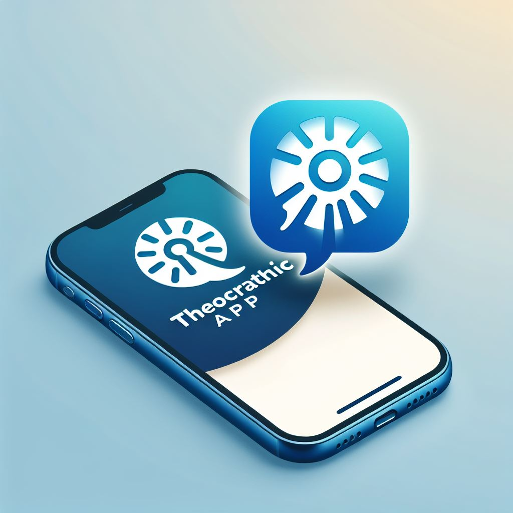

# Hello World! I'm Jestruyo 👋

  

  
  
  
  

## 🚀 About Me

I'm passionate about technology and software development, driven by the mission to create innovative solutions that make a real impact. I love building web applications, automating workflows, and exploring the power of artificial intelligence and cloud computing. Every line of code is an opportunity for growth, learning, and meaningful change.

My goal is to contribute to the future of the tech industry by combining creativity, logic, and a deep passion for solving real-world problems.

> ## ⚡ Technology is nothing — what really matters is trusting <strong><code>&lt;Developers/&gt;</code>🔥</strong>

## 💻 Technologies & Tools

### 🧠 Languages & Frameworks

  <marquee behavior="scroll" direction="left" scrollamount="7">
    
    
    
    
    
    
    
    
    
  </marquee>

### 🛠️ Tools & Platforms

  
  
  
  
  
  
  
  

### 📚 Currently Learning

  
  
  
  

## 🔭 Featured Projects

<table>
  <tr>
    <td width="50%" valign="top">
      <h3 align="center">Bot | TheocraticApp</h3>
      

        
        
<strong>TheocraticApp is a bot to manage and automate theocratic administrative processes, from the WhatsApp platform.</strong>

        
<em>Check it out: <a href="https://github.com/Jestruyo/TheocraticApp.git">Api Open source</a></em>

      

    </td>
    <td width="50%" valign="top">
      <h3 align="center">Collaboration | Aura Os</h3>
      

        
        
<strong>Web Os Simulator</strong>

        
<em>Check it out: <a href="https://juansesdev.github.io/AuraOs/">Demo</a></em>

      

    </td>
  </tr>
</table>

## 🌱 Professional Development

My growth path focuses on:

- 🌟 **System Architecture**: Designing scalable and maintainable solutions
- 📱 **Advanced Mobile Development**: Creating seamless experiences on iOS and Android
- ☁️ **Cloud Computing**: Implementing serverless infrastructures and microservices
- 🧩 **Design Patterns**: Applying best practices in software development
- 🔄 **DevOps**: Integrating CI/CD to optimize workflows

## 💡 Areas of Interest

  <table>
    <tr>
      <td align="center"><b>💼 Enterprise Development</b></td>
      <td align="center"><b>📱 Mobile Applications</b></td>
      <td align="center"><b>🎮 Game Dev</b></td>
    </tr>
    <tr>
      <td>Creating robust solutions for corporate environments, optimizing processes and improving operational efficiency.</td>
      <td>Designing intuitive mobile experiences that connect users with practical solutions for everyday problems.</td>
      <td>Exploring interactive mechanics and immersive narratives through game programming.</td>
    </tr>
    <tr>
      <td align="center"><b>🎨 UI/UX Design</b></td>
      <td align="center"><b>☁️ Cloud Architecture</b></td>
      <td align="center"><b>🤖 Artificial Intelligence</b></td>
    </tr>
    <tr>
      <td>Creating elegant and functional interfaces that prioritize user experience and accessibility.</td>
      <td>Implementing scalable and secure cloud infrastructures using industry best practices.</td>
      <td>Integrating AI capabilities to create more intelligent and adaptive solutions for users.</td>
    </tr>
  </table>

## 📊 GitHub Stats

  

  
  

  

## ⚡ Fun Fact
My creative process follows the same pattern whether I'm developing code or exploring virtual worlds: first observing the big picture, then experimenting with different approaches, and finally finding solutions others might have overlooked. Curiosity is my best tool!

  

  <i>Interested in collaborating? Let's build something extraordinary together!</i>

---

📫 The best way to reach me is through [LinkedIn](https://www.linkedin.com/in/sebastian-vargas-122aa4285/) or via email at juansesdevcontact@gmail.com
